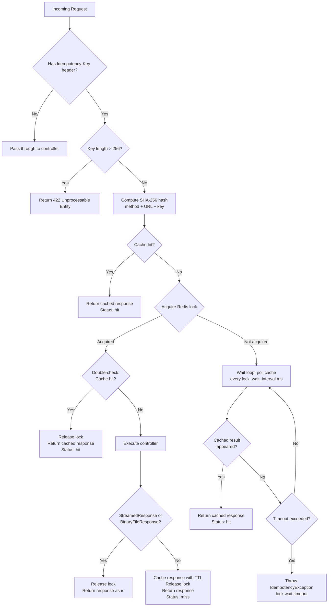

# Laravel Idempotency Middleware

[](https://www.php.net/)
[](https://laravel.com/)
[](LICENSE)

A Laravel middleware that provides automatic HTTP request idempotency using the `Idempotency-Key` header pattern. Prevents duplicate side effects caused by retried or duplicated requests in distributed systems.

---

## Problem Statement

In distributed systems, HTTP requests can be delivered more than once. Network timeouts, client retries, load balancer replays, and user double-clicks all lead to the same request hitting your server multiple times. For read operations (GET), this is harmless -- HTTP GET is naturally idempotent. But for write operations (POST, PUT, PATCH), duplicate execution causes real damage:

- **Payment systems**: A retry on `POST /charges` debits the customer twice. Stripe documented this exact problem and solved it by requiring an `Idempotency-Key` header on mutating API calls.
- **E-commerce**: A duplicated `POST /orders` creates two identical orders, ships two packages, charges the customer double.
- **Financial APIs**: A retried `POST /transfers` moves money twice between accounts.
- **Inventory management**: A repeated `POST /reservations` reserves double the stock, causing overselling when other customers see reduced availability.

### Why client-side deduplication is not enough

Client-side retry logic (exponential backoff, circuit breakers) reduces duplicates but cannot eliminate them. Consider:

1. Client sends `POST /payments`. The server processes it successfully.
2. The response is lost due to a network partition.
3. The client retries (correctly, from its perspective -- it never received confirmation).
4. The server executes the payment handler again. Double charge.

The only reliable solution is **server-side idempotency**: the server recognizes it has already processed this exact request and returns the original response without re-executing the handler.

### What idempotency means for HTTP APIs

An operation is idempotent if executing it multiple times produces the same result as executing it once. This middleware makes any endpoint idempotent by:

1. Accepting a client-provided `Idempotency-Key` header that uniquely identifies the intent.
2. Caching the full response (status code, headers, body) on first execution.
3. Returning the cached response verbatim on subsequent requests with the same key.

---

## Solution

This package provides a drop-in Laravel middleware that implements the idempotency key pattern with the following guarantees:

- **Exactly-once semantics**: The route handler executes at most once per unique key (scoped to method + URL).
- **Race condition safety**: Concurrent requests with the same key are serialized via Redis distributed locks with a double-check locking pattern.
- **Full response fidelity**: Status codes, headers, and body are preserved exactly as the original response.
- **Observability**: Every response includes an `Idempotency-Key-Status` header (`hit` or `miss`) so clients and monitoring systems can track cache behavior.

### How It Works (High-Level)

```
Client                          Middleware                         Your Controller
  |                                |                                     |
  |-- POST /api/orders ----------->|                                     |
  |   Idempotency-Key: abc-123    |                                     |
  |                                |-- SHA-256(POST|url|abc-123)         |
  |                                |-- Check Redis cache                 |
  |                                |-- Cache MISS                        |
  |                                |-- Acquire lock                      |
  |                                |-- Double-check cache                |
  |                                |-- Forward request ----------------->|
  |                                |                                     |-- Process order
  |                                |<-- Response 201 -------------------|
  |                                |-- Cache response (24h TTL)          |
  |                                |-- Release lock                      |
  |<-- 201 Created ---------------|                                     |
  |   Idempotency-Key-Status: miss|                                     |
  |                                |                                     |
  |-- POST /api/orders ----------->|  (retry / duplicate)               |
  |   Idempotency-Key: abc-123    |                                     |
  |                                |-- SHA-256(POST|url|abc-123)         |
  |                                |-- Check Redis cache                 |
  |                                |-- Cache HIT                         |
  |<-- 201 Created ---------------|  (from cache, handler NOT called)   |
  |   Idempotency-Key-Status: hit |                                     |
```

---

## Tech Stack

| Component | Version | Purpose |
|-----------|---------|---------|
| PHP | >= 8.2 | Runtime with strict typing, constructor promotion, named arguments |
| Laravel | 10.x / 11.x / 12.x | Framework integration via ServiceProvider, middleware pipeline |
| Redis (phpredis) | * | Atomic locks (`SET NX EX`), response cache with TTL |
| Pest PHP | 2.x / 3.x | Testing framework (Feature + Unit tests) |
| Larastan | 2.x / 3.x | Static analysis at level 6 |
| Laravel Pint | 1.x | Code style enforcement (PSR-12) |

---

## Architecture

### Components

```
src/
├── IdempotencyMiddleware.php            # Core middleware: hash, lock, cache, respond
├── IdempotencyServiceProvider.php       # Laravel service provider, config publishing
├── Storage/
│   ├── IdempotencyStorageInterface.php  # Storage contract: get, put, lock, unlock
│   └── RedisStorage.php                 # Redis implementation via phpredis
└── Exceptions/
    └── IdempotencyException.php         # Lock timeout exception
```

| Component | Responsibility |
|-----------|---------------|
| **IdempotencyMiddleware** | Orchestrates the full flow: extracts the key, computes the hash, checks cache, acquires lock, delegates to the next handler, caches the response, and releases the lock. Contains no storage logic. |
| **IdempotencyStorageInterface** | Defines the storage contract with four operations: `get`, `put`, `lock`, `unlock`. Enables swapping Redis for any other backend (DynamoDB, database, in-memory for tests). |
| **RedisStorage** | Implements the storage interface using the phpredis C extension directly (not Laravel's `Cache` facade). Uses `SET NX EX` for atomic lock acquisition and `SETEX` for cached responses with TTL. |
| **IdempotencyServiceProvider** | Registers the storage binding as a singleton, merges default config, and publishes the config file for customization. |
| **IdempotencyException** | Named exception for lock wait timeouts. Allows the application's exception handler to return an appropriate HTTP response (typically 409 Conflict). |

### Request Flow



### Design Decisions

Each decision below represents a deliberate trade-off. These are the kinds of choices that matter in production systems.

#### 1. SHA-256 hash of method + URL + key

```php
hash('sha256', $request->method() . '|' . $request->fullUrl() . '|' . $idempotencyKey)
```

**Why method + URL are included**: The same idempotency key sent to `POST /orders` and `POST /payments` must not collide. Without scoping by endpoint, a key intended for order creation could return a cached payment response. Including the HTTP method prevents `POST /resource` and `PUT /resource` from sharing cache entries.

**Why SHA-256**: Produces a fixed 64-character hex string regardless of key length or URL complexity. This gives uniform Redis key sizes and avoids special characters in Redis keys. The hash is not used for security -- it is a deterministic fingerprint.

**Why request body is NOT included**: By design, the idempotency key alone (scoped to method + URL) identifies the operation intent. If a client sends different bodies with the same key, the second request returns the cached response from the first. This is correct behavior -- it prevents the "same intent, different payload" problem where a client retries with slightly modified data and accidentally creates a second resource.

#### 2. Double-check locking pattern

```
1. Check cache       -> miss
2. Acquire lock      -> success
3. Check cache again -> still miss  (double-check)
4. Execute handler
5. Cache response
6. Release lock
```

**The problem it solves**: Between step 1 (cache miss) and step 2 (lock acquired), another request with the same key may have already executed the handler and cached the result. Without the double-check, we would execute the handler twice -- exactly the scenario idempotency is supposed to prevent.

**Why not just lock first**: Locking is expensive (Redis round-trip). The first cache check is an optimistic read that avoids lock acquisition entirely on cache hits, which is the common case in retry scenarios.

#### 3. All responses are cached, including 5xx errors

Following Stripe's idempotency implementation: if the server returns a 500 error, that error is cached and returned on retry. This is intentional.

**Rationale**: If we only cached successful responses, a transient 500 would leave no cache entry, and the retry would execute the handler again. But what if the first request partially succeeded (e.g., charged the card but failed to create the order record)? Re-executing would double-charge. Caching the error lets the client see the failure and take corrective action (e.g., check the payment status) rather than blindly retrying into a second charge.

**Trade-off**: A truly transient error (e.g., momentary Redis blip) gets "stuck" in cache until TTL expires. This is the safer default -- the client can always use a new idempotency key for a genuinely new attempt.

#### 4. Separate lock_ttl and lock_wait_timeout

Two distinct timeouts control different failure modes:

- **`lock_ttl`** (default: 30s): How long the Redis lock exists. This is a safety net -- if the process holding the lock crashes, the lock auto-expires after this period. Must be greater than your slowest endpoint's processing time.
- **`lock_wait_timeout`** (default: 10s): How long a competing request will wait for the lock holder to finish. After this, an `IdempotencyException` is thrown (which should map to HTTP 409).

**Why they are separate**: A slow endpoint (e.g., 15s) needs `lock_ttl >= 15` so the lock does not expire mid-processing. But competing requests should not wait 15s -- they should timeout faster and let the client decide what to do. Separate values give operators independent control over crash recovery (`lock_ttl`) and user experience (`lock_wait_timeout`).

#### 5. JSON_THROW_ON_ERROR for data integrity

```php
json_decode((string) $result, true, 512, JSON_THROW_ON_ERROR);
json_encode($data, JSON_THROW_ON_ERROR);
```

By default, PHP's `json_encode` / `json_decode` return `false` / `null` on failure and set a global error flag. With `JSON_THROW_ON_ERROR`, corrupt cached data or non-serializable responses throw a `JsonException` immediately instead of propagating silently as `null` values through the system. This converts a data corruption issue into a visible, catchable exception.

#### 6. Idempotency-Key-Status response header

Every idempotent response includes `Idempotency-Key-Status: hit` or `Idempotency-Key-Status: miss`.

**For clients**: Lets the caller know whether the response is fresh or cached. Useful for logging, debugging, and metrics.

**For infrastructure**: Load balancers and API gateways can aggregate this header for monitoring cache hit rates, detecting unusual retry patterns, and alerting on high miss rates that might indicate client misconfiguration.

**Why requests without the header get no status**: No `Idempotency-Key` means the middleware is a no-op. Adding a status header would be misleading -- there is no idempotency behavior to report on.

#### 7. StreamedResponse / BinaryFileResponse exclusion

```php
if ($response instanceof StreamedResponse || $response instanceof BinaryFileResponse) {
    return $response;
}
```

Streamed responses cannot be cached because their content is generated on-the-fly via a callback and may be arbitrarily large. Attempting to capture `getContent()` on a `StreamedResponse` returns `false`. Binary file responses reference files on disk and may be gigabytes in size. Both are excluded from caching and returned directly. The lock is still released via the `finally` block.

#### 8. Key length validation (256 characters max)

```php
if (mb_strlen($idempotencyKey) > 256) {
    return new IlluminateResponse(
        json_encode(['error' => 'Idempotency-Key must not exceed 256 characters']),
        422,
    );
}
```

Prevents abuse via arbitrarily large headers. The 256-character limit accommodates UUID v4 (36 chars), UUID with prefix (`pay_01234567-...`, ~50 chars), and any reasonable key format while rejecting pathological inputs. Validation happens before any Redis operations, so an oversized key cannot waste resources.

---

## Installation

```bash
composer require fedorenko-alex322/idempotency-middleware
```

The service provider is auto-discovered via Laravel's package discovery. No manual registration required.

### Publish Configuration

```bash
php artisan vendor:publish --tag=idempotency-config
```

This creates `config/idempotency.php` in your application.

---

## Configuration

| Parameter | Env Variable | Default | Description |
|-----------|-------------|---------|-------------|
| `ttl` | `IDEMPOTENCY_TTL` | `86400` (24h) | How long cached responses are stored in Redis (seconds). After expiry, the same idempotency key will execute the handler again. |
| `redis_connection` | `IDEMPOTENCY_REDIS_CONNECTION` | `default` | Redis connection name from `config/database.php`. Use a dedicated connection to isolate idempotency data from application cache. |
| `prefix` | `IDEMPOTENCY_PREFIX` | `idempotency:` | Prefix for all Redis keys. Useful for namespacing in shared Redis instances. |
| `lock_ttl` | `IDEMPOTENCY_LOCK_TTL` | `30` | Maximum time (seconds) a distributed lock is held. Acts as a crash recovery mechanism -- if the lock holder dies, the lock auto-expires. Must exceed your slowest endpoint's processing time. |
| `lock_wait_timeout` | `IDEMPOTENCY_LOCK_WAIT_TIMEOUT` | `10` | Maximum time (seconds) a concurrent request waits for the lock holder to finish before throwing `IdempotencyException`. |
| `lock_wait_interval` | `IDEMPOTENCY_LOCK_WAIT_INTERVAL` | `100` | Polling interval (milliseconds) while waiting for a concurrent request to complete. Lower values detect completion faster but increase Redis load. |

### Example: Tuning for a Slow Payment Endpoint

```env
# Payment processing can take up to 20 seconds
IDEMPOTENCY_LOCK_TTL=60
# But clients should know within 25 seconds if something is wrong
IDEMPOTENCY_LOCK_WAIT_TIMEOUT=25
# Poll every 200ms (lower Redis load for long-running operations)
IDEMPOTENCY_LOCK_WAIT_INTERVAL=200
# Keep cached responses for 48 hours
IDEMPOTENCY_TTL=172800
```

---

## Usage

### Apply to Route Groups

```php
// routes/api.php
use FedorenkoAlex322\IdempotencyMiddleware\IdempotencyMiddleware;

// Apply to specific routes
Route::post('/api/orders', [OrderController::class, 'store'])
    ->middleware(IdempotencyMiddleware::class);

// Apply to a group
Route::middleware(IdempotencyMiddleware::class)->group(function () {
    Route::post('/api/payments', [PaymentController::class, 'charge']);
    Route::post('/api/transfers', [TransferController::class, 'create']);
    Route::put('/api/orders/{id}', [OrderController::class, 'update']);
});
```

### API Example

**Client (first request):**

```bash
curl -X POST https://api.example.com/api/orders \
  -H "Content-Type: application/json" \
  -H "Idempotency-Key: 550e8400-e29b-41d4-a716-446655440000" \
  -d '{"product_id": 42, "quantity": 1}'
```

**Response (first call -- handler executes):**

```http
HTTP/1.1 201 Created
Content-Type: application/json
Idempotency-Key-Status: miss

{"id": 12345, "product_id": 42, "quantity": 1, "status": "confirmed"}
```

**Client (retry -- same key):**

```bash
curl -X POST https://api.example.com/api/orders \
  -H "Content-Type: application/json" \
  -H "Idempotency-Key: 550e8400-e29b-41d4-a716-446655440000" \
  -d '{"product_id": 42, "quantity": 1}'
```

**Response (from cache -- handler does NOT execute):**

```http
HTTP/1.1 201 Created
Content-Type: application/json
Idempotency-Key-Status: hit

{"id": 12345, "product_id": 42, "quantity": 1, "status": "confirmed"}
```

The response is byte-for-byte identical: same status code, same headers, same body.

### Handling Lock Timeouts

When a concurrent request cannot acquire the lock within `lock_wait_timeout`, an `IdempotencyException` is thrown. Handle it in your exception handler:

```php
// app/Exceptions/Handler.php (Laravel 10)
// or bootstrap/app.php (Laravel 11+)

use FedorenkoAlex322\IdempotencyMiddleware\Exceptions\IdempotencyException;

// Laravel 11+ (bootstrap/app.php)
->withExceptions(function (Exceptions $exceptions) {
    $exceptions->renderable(function (IdempotencyException $e) {
        return response()->json([
            'error' => 'A request with this idempotency key is already being processed. Please retry later.',
        ], 409);
    });
})
```

### Response Headers

| Header | Values | Description |
|--------|--------|-------------|
| `Idempotency-Key-Status` | `miss` | First execution -- the handler ran and the response was cached. |
| `Idempotency-Key-Status` | `hit` | Cache hit -- the response was returned from cache without executing the handler. |
| *(absent)* | | No `Idempotency-Key` header was provided. The middleware was a no-op. |

---

## Edge Cases and Limitations

### Different body with the same key

If a client sends `Idempotency-Key: abc` with `{"amount": 100}` and then sends `Idempotency-Key: abc` with `{"amount": 200}` to the same endpoint, the second request receives the cached response from the first. The request body is intentionally **not** part of the cache key. This matches Stripe's behavior and prevents the "same intent, different payload" problem. If you need a genuinely different operation, use a different idempotency key.

### Streaming and binary responses

`StreamedResponse` and `BinaryFileResponse` are not cached. These responses are returned directly from the controller, bypassing the caching step. The lock is still properly released. If your idempotent endpoint returns streamed data, the middleware provides lock-based serialization but not response caching.

### Large responses

Cached responses are stored as JSON-encoded strings in Redis (status code + headers + body). For endpoints returning large payloads (e.g., 10MB JSON), this consumes equivalent Redis memory per unique idempotency key. Monitor Redis memory usage and adjust `ttl` accordingly, or exclude large-response endpoints from the middleware.

### TTL expiry behavior

After `ttl` seconds, the cached response is evicted from Redis. A subsequent request with the same idempotency key will execute the handler again as if it were a new request. For operations where "once ever" semantics are required (not just "once per TTL window"), persist processed keys in your database.

### Error response caching

All HTTP responses are cached, including 4xx and 5xx errors. This is deliberate (see [Design Decisions](#3-all-responses-are-cached-including-5xx-errors)). If you need to retry after a transient error, generate a new idempotency key.

### Key format recommendations

Use UUID v4 for idempotency keys:

```
550e8400-e29b-41d4-a716-446655440000
```

Alternatively, use a prefixed format for easier debugging:

```
order_550e8400-e29b-41d4-a716-446655440000
pay_01HQ3GKXR6KZQW8T0YJGQM5N2V
```

The key must not exceed 256 characters. Any string format is accepted -- the middleware does not enforce UUID.

### Requests without the header

Requests that do not include the `Idempotency-Key` header pass through the middleware untouched. No hashing, no locking, no caching. This means the middleware is safe to apply broadly -- it only activates when the client explicitly opts in.

---

## Custom Storage Backend

The package uses an `IdempotencyStorageInterface` contract. To use a different backend (e.g., DynamoDB, PostgreSQL advisory locks), implement the interface and rebind in a service provider:

```php
use FedorenkoAlex322\IdempotencyMiddleware\Storage\IdempotencyStorageInterface;

$this->app->singleton(IdempotencyStorageInterface::class, function ($app) {
    return new DynamoDbStorage(/* ... */);
});
```

The interface requires four methods:

```php
interface IdempotencyStorageInterface
{
    public function get(string $key): ?array;                    // Retrieve cached response
    public function put(string $key, array $data, int $ttl): void; // Store response with TTL
    public function lock(string $key, int $ttl): bool;           // Acquire distributed lock (atomic)
    public function unlock(string $key): void;                   // Release distributed lock
}
```

---

## Testing

```bash
vendor/bin/pest
```

### Test Coverage

The test suite covers three categories:

**Feature tests** (`tests/Feature/IdempotencyMiddlewareTest.php`):
- Requests without `Idempotency-Key` pass through unmodified
- First request returns `Idempotency-Key-Status: miss`
- Repeated request returns identical cached response with `Idempotency-Key-Status: hit`
- Same key on different endpoints does not produce collisions
- Different keys on the same endpoint are independent
- Cached response preserves status code, headers, and body exactly
- Error responses (5xx) are cached and returned on retry

**Race condition tests** (`tests/Feature/RaceConditionTest.php`):
- Concurrent request waits for the lock holder, then receives the cached result
- Lock wait timeout throws `IdempotencyException` when the lock holder does not complete in time

**Unit tests** (`tests/Unit/HashGenerationTest.php`):
- Identical inputs produce identical SHA-256 hashes
- Different HTTP methods produce different hashes
- Different URLs produce different hashes
- Different idempotency keys produce different hashes
- Hash output is a valid 64-character hex string

Tests use an in-memory `ArrayStorage` stub that implements `IdempotencyStorageInterface`, so no running Redis instance is required.

### Static Analysis

```bash
vendor/bin/phpstan analyse
```

The project is analyzed at PHPStan level 6 with Larastan extensions.

### Code Style

```bash
vendor/bin/pint
```

Enforces PSR-12 code style.

---

## Requirements

- PHP >= 8.2
- Laravel 10.x, 11.x, or 12.x
- Redis server with phpredis PHP extension
- ext-json

---

## License

MIT. See [LICENSE](LICENSE) for details.
